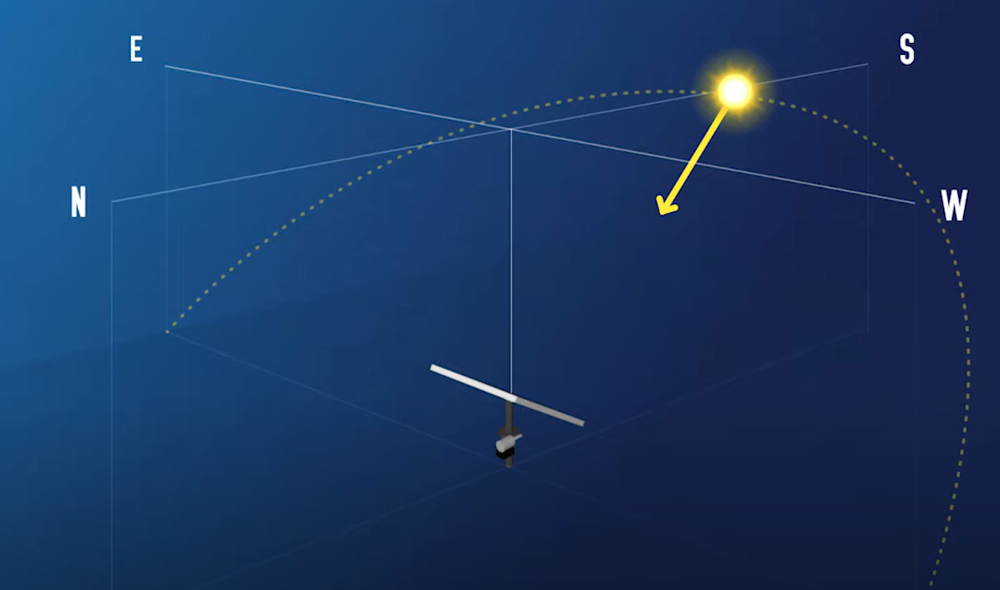
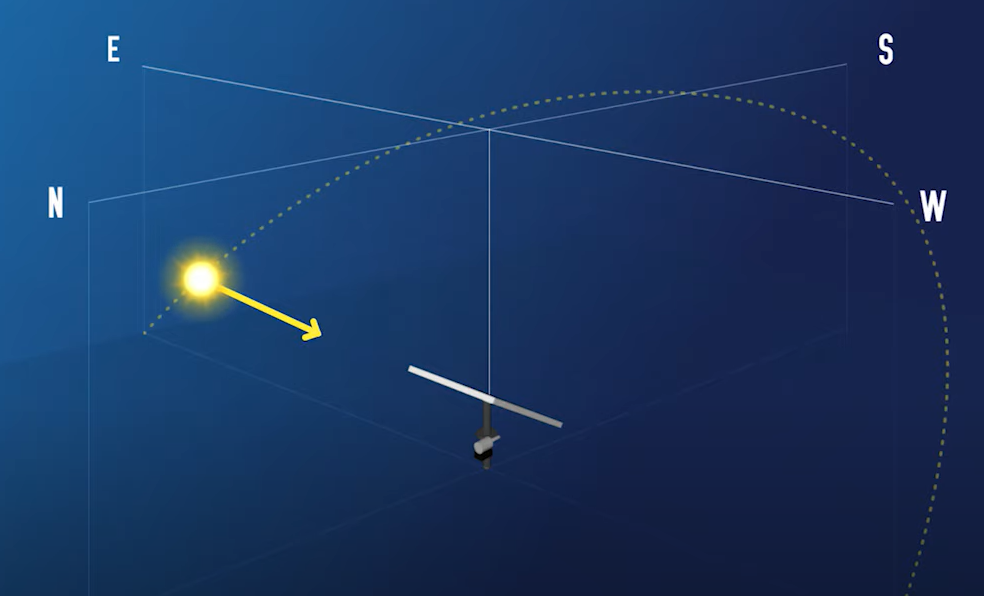
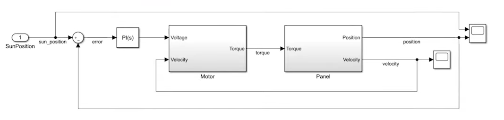
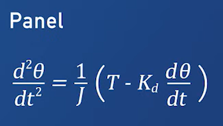
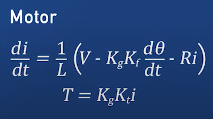
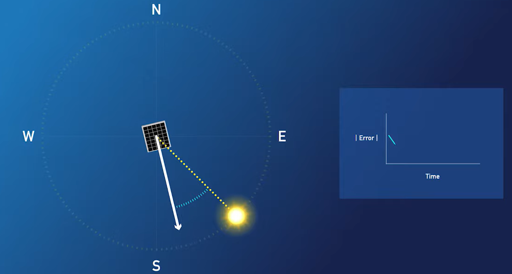
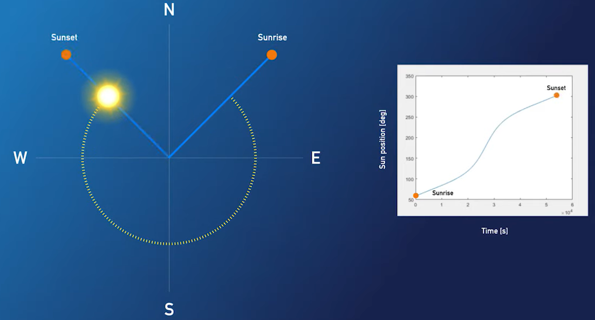
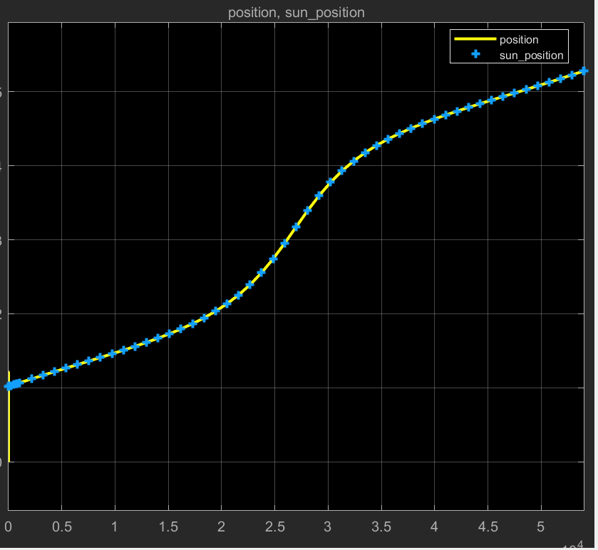

# Sun Tracking System

Tutorial from [Getting Started With Simulink for Control](https://es.mathworks.com/matlabcentral/fileexchange/73257-getting-started-with-simulink-for-controls-example-files?s_eid=PSM_15028), [Youtube video](https://www.youtube.com/watch?v=bE179wgm164)

## About

### Problem

We have some solar panel to generate electricity. This panels face south and are fixed in place. That means they produce more electricity when the sun is shining directly on them in the middle of the day (Figure 1) and less power when the sun is in the east (Figure 2) or west late in the day. 

Objective: Sun tracking system for solar panels to maximize electricy production.

### Simulink

#### Step 1 - Model the physical system
The physical system has two main components: 
- The panel 
- The motor 
#### Step 2 - Design the controller

#### Step 3 - Test the design
We load some sun position data, plot the data and see the results.

